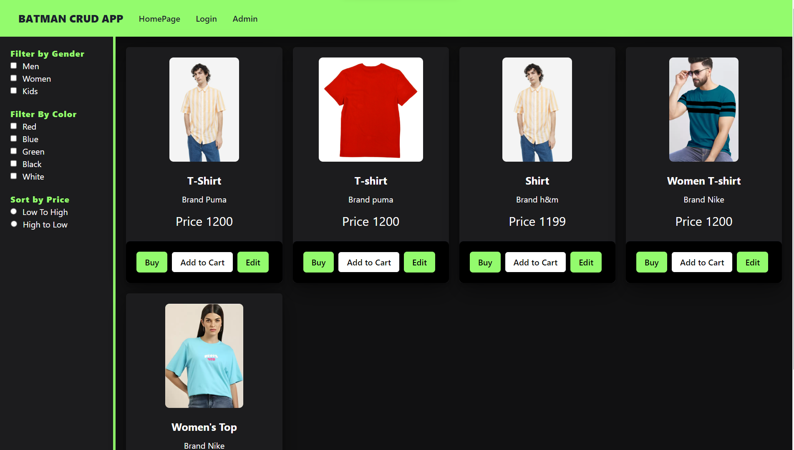

# React Crud App

### This is a Advanced CURD Application.
An E-Commerce CRUD (Create, Read, Update, Delete) app is a web application designed specifically for managing the products and inventory of an online store. This type of application empowers sellers to easily add, edit, update, and remove products while providing a seamless shopping experience for customers 

## Visit
- [FronEnd](https://crud-hpere6ysm-deveshsuryawanshi.vercel.app/?order=)
- [Json Server Backend](https://react-crud-app-json-server-ojtv.onrender.com)

## Tech Stack
- **Frontend**
     - React
     - Redux
     - Styled-Components
     - React-Router-Dom
     - Axios
     - Chakra Ui
- **Backend**
     - Json Server
     - Render

## Preview

### Home Page

### Login Page

### Admin Page

